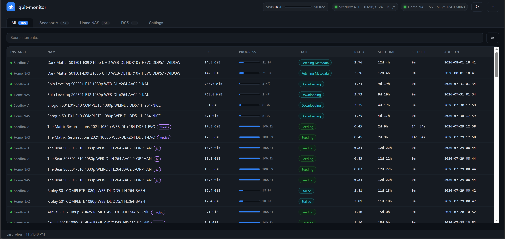
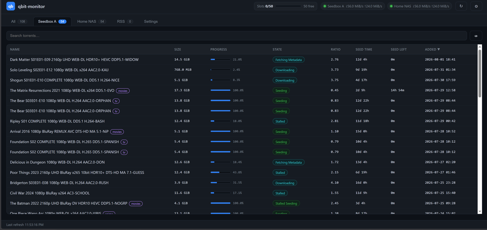
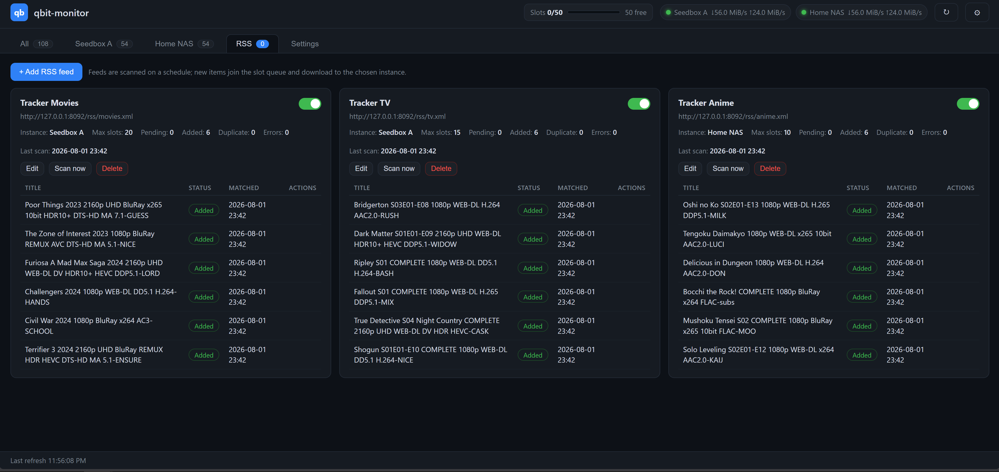
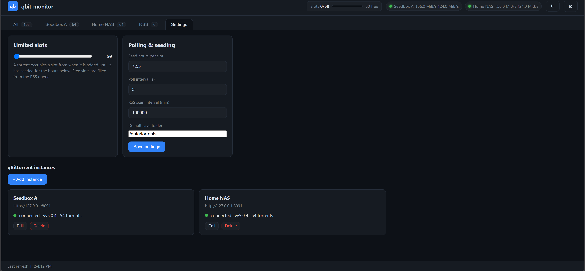
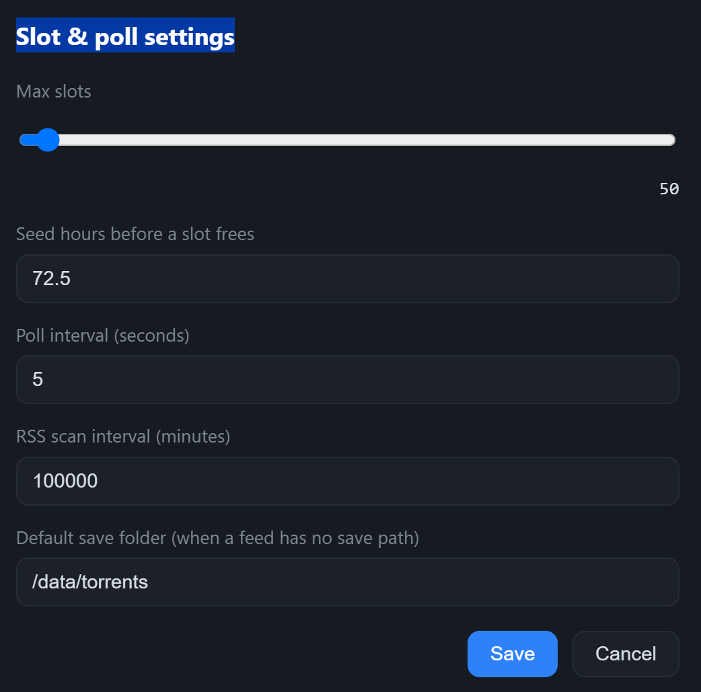

# qbit-monitor-rss

[](https://github.com/wildfirebill-unraid/qbit-monitor-rss/releases)
[](LICENSE)
[](https://github.com/wildfirebill-unraid/qbit-monitor-rss/pkgs/container/qbit-monitor-rss)
[](requirements.txt)
[](https://unraid.net)
[](Dockerfile)
[](https://github.com/wildfirebill-unraid/qbit-monitor-rss/pulls)


**qbit-monitor-rss** is a self-hosted, Dockerized web app for [Unraid](https://unraid.net) (and any other Docker host) that centralizes **multiple qBittorrent instances** and automatically grabs new releases from **private-tracker RSS feeds** — one dashboard, one configurable torrent slot budget per tracker, zero cross-instance duplicates.

Think of it as a lightweight "tracker gatekeeper": it watches your private-tracker RSS feeds, filters already-downloaded content by **info-hash and normalized title**, and adds only genuinely new torrents to the qBittorrent instance you choose — all under a per-tracker **slot cap** (all feeds of one tracker share that tracker's budget) and automatic slot release after a seed-time requirement is met.

- **Multi-instance support** — watch any number of qBittorrent WebUI instances from a single UI (one tab each).
- **Private-tracker friendly** — parse RSS 2.0 and Atom feeds, including `enclosure` and `<link href="...">` torrent downloads.
- **No duplicates across feeds or instances** — info-hash check (already added + live client) plus normalized-title check.
- **Configurable slot cap per tracker** — each tracker has its own slot cap (default 50) and seed-time requirement (default 72.5 h); every feed pointing at that tracker shares the same slot budget. Slots are consumed on add and released after `seed_hours` of seeding or when a torrent vanishes from the client.
- **Automatic + manual scanning** — per-feed **Scan** button, a global force scan, and a scheduled scan every `rss_scan_interval_minutes`.
- **Per-feed target routing** — each feed points at the instance it should add to, with optional save path, category (autocompleted from the instance's categories), and the tracker whose slot budget it belongs to.
- **Default save folder** — torrents land in `/data/torrents` by default (configurable); feeds can override per-feed.
- **Manual add + move** — add magnet links / `.torrent` URLs straight into the GUI (one per line, optional save path/category) **or upload one or more `.torrent` files from your machine** (multi-select supported, optional tracker), and move any torrent between instances from the table — files stay on disk, the destination re-adds at the same save path and rechecks.
- **Persistent storage** — SQLite database and `config.json` live in `/data`, so your state survives restarts and updates.
- **Web GUI included** — no external frontend build; a clean, sortable, tabbed interface is served directly by the app, with a **Seed left** column showing time until a slot frees.
- **Multi-arch container** — `linux/amd64` and `linux/arm64` images published to GHCR on every release.

## Table of contents

- [Why qbit-monitor-rss?](#why-qbit-monitor-rss)
- [Screenshots](#screenshots)
- [Quick start (Docker)](#quick-start-docker)
- [Configuration](#configuration)
  - [Settings](#settings)
  - [qBittorrent instances](#qbittorrent-instances)
  - [Trackers](#trackers)
  - [RSS feeds](#rss-feeds)
- [How an item flows](#how-an-item-flows)
- [TODO](#todo)
- [FAQ](#faq)
- [Troubleshooting](#troubleshooting)
- [REST API](#rest-api)
- [Local development](#local-development)
- [Contributing](#contributing)
- [License](#license)

## Why qbit-monitor-rss?

Managing a private-tracker seedbox is usually a juggling act: multiple qBittorrent instances, half a dozen RSS feeds, and a constant fear of exceeding your tracker's download/slot limits. qbit-monitor-rss does the bookkeeping for you:

1. It watches every configured RSS feed and recognizes which items you have already fetched — by guid, by info-hash, and by normalized title.
2. It only hands new, unique torrents to the qBittorrent instance you chose for that feed.
3. It enforces each tracker's slot budget so you never exceed your configured limit, releasing slots only once a torrent has seeded long enough (or disappears).

Result: your private-tracker ratio grows, your slot count stays under control, and you never download the same release twice — across any number of instances.

## Screenshots

The whole workflow lives in the web GUI — no config file editing required.

| View | |
|---|---|
| **All torrents** — every instance in one sortable table, with a live slot bar and instance status dots |  |
| **Per-instance view** — drill into a single qBittorrent instance |  |
| **RSS feeds** — scanned items with state (pending / added / duplicate / error) |  |
| **Add / edit feed** — target instance, save path, autocompleted category, and tracker |  |
| **Slot status** — used / free slots and queued RSS items |  |

## Quick start (Docker)

The image runs on **any Docker host** — Unraid, Synology, a VPS, or a plain
Linux box. The steps below show Unraid but the same image/compose file works
everywhere; only the network setup differs.

1. On your Docker host, clone or copy this repo (or pull the image from GHCR):

   ```sh
   docker pull ghcr.io/wildfirebill-unraid/qbit-monitor-rss:latest
   ```

2. Edit `docker-compose.yml`:
   - Map a free host port on the left, e.g. `8200:8000`.
   - Attach to the docker network your qBittorrent instances live on if you want
     to reach them by container name instead of IP:
     ```yaml
     networks:
       qbit-monitor:
         networks:
           qbitnet:
             ipv4_address: 172.18.0.20
     ```
     with `networks: { qbitnet: { external: true } }` at the bottom.
3. Run:

   ```sh
   docker compose up -d --build
   ```

4. Open `http://<host-ip>:8200` and add your qBittorrent instances + RSS feeds
   from the web UI.

Data (SQLite database + `config.json`) persists in `./data` (`/data` inside the
container). Set the `DATA_DIR` environment variable to relocate it.

### Unraid template

An official [Unraid Community Applications](https://unraid.net/community-apps)
template is included at [`unraid/qbit-monitor-rss.xml`](unraid/qbit-monitor-rss.xml)
— the same schema used by the Community Apps plugin, so you can drop it into
`/boot/config/plugins/dockerMan/templates-user/` for a one-click install.

## Configuration

Config is `$DATA_DIR/config.json` (created on first run with defaults) and is
also editable from the GUI — no file editing required for day-to-day use.

### Settings

| Setting | Default | Range | Meaning |
|---|---|---|---|
| `poll_interval_seconds` | 30 | 5–3600 | How often live torrent state is refreshed |
| `rss_scan_interval_minutes` | 15 | 1–1440 | How often RSS feeds are scanned automatically |
| `data_folder` | `/data/torrents` | — | Default save path used for feeds without a per-feed save path |

Slot caps and seed hours are **per tracker**, not global — see [Trackers](#trackers). The `data_folder` setting only affects feeds that don't set their own save path.

### qBittorrent instances

Each instance is `URL + username + password`. Use the host IP and per-instance
port, e.g. `http://192.168.0.15:8081`. The app logs in via the WebUI API
(`/api/v2/auth/login`) and re-authenticates on 401/403.

**Commercial seedboxes work too.** The app only speaks the standard qBittorrent
WebUI API, so any provider running qBittorrent can be added as an instance —
Feral, Whatbox, Ultra.cc, Seedboxes.cc, and similar. Just enable the seedbox's
qBittorrent **WebUI** in its control panel, then add it with the WebUI URL and
credentials. Two things to watch:

- **Reachability** — the app must be able to reach the seedbox URL. From a
  container that's normally fine, but confirm your provider doesn't block the
  API endpoints or require a whitelisted IP.
- **Provider limits** — some hosts cap API access, auth attempts, or concurrent
  connections; a persistent `login failed` or timeouts usually mean a provider
  policy, not an app issue.

### Trackers

Slot and seed limits belong to **trackers**, not feeds — because multiple feeds
can come from the same tracker, all feeds of one tracker share that tracker's
slot budget (e.g. a cap of 200 slots across every feed from that tracker).

| Setting | Default | Meaning |
|---|---|---|
| `max_slots` | 50 | Max concurrent active slots shared across all feeds of this tracker |
| `seed_hours` | 72.5 | Seed time (hours) before a torrent frees its slot |
| `public` | false | Public trackers have **no slot or seed limits** — torrents are added unconditionally and never occupy a slot |

A feed that has no `tracker_id` (or whose tracker was deleted) falls back to the
defaults above: 50 slots / 72.5 h, non-public. Public-tracker torrents are
tracked with `slot_released=1` so they never count toward any budget. Private
feeds stay queued while their tracker's budget is full and retry automatically
as slots free up.

### RSS feeds

Each feed points at an RSS/Atom URL, a target instance, an optional save path,
category, and the tracker it belongs to. The category field is autocompleted
from the target instance's existing qBittorrent categories. If a feed has no
save path, the global `data_folder` setting is used. The feed's slot cap and
seed-time requirement come entirely from its tracker (see
[Trackers](#trackers)); feeds without a tracker use the built-in defaults.
Scanning is manual (per-feed **Scan** button or the global force
scan) and automatic every `rss_scan_interval_minutes`.

## How an item flows

1. **Scan** parses the feed (RSS 2.0 or Atom), extracting
   guid / title / publish date / torrent URL (enclosure or link).
2. New guids become **pending**; seen guids are skipped.
3. The queue processor downloads the `.torrent`, computes its **info-hash**,
   and checks duplicates:
   - already added anywhere (hash in DB),
   - already present in any live client,
   - normalized title already tracked.
4. If unique **and** a slot is free in the item's tracker budget (public
   trackers always pass), the torrent is uploaded to the target
   instance and the slot is marked used. If the tracker's cap is reached it
   stays queued.
5. Every poll, torrents with `seeding_time >= seed_hours * 3600` (or that
   vanished from the client) release their slot, letting the queue advance.

### Manual add / move

The **+ Add magnet** button (top of the torrents table) sends magnet links or
`.torrent` URLs to a chosen instance — one per line, with optional save path and
category. The **+ Add torrent** button uploads one or more local `.torrent`
files from your machine to a chosen instance (multi-select supported), also
with optional save path and category.

Both go straight to the client. If you pick a private tracker in the dialog, the
added torrents are tracked against that tracker's slot budget (just like RSS
adds); if you leave the tracker unselected they are untracked, one-off
downloads outside any budget.

The **Move** button (per-row, shown when you have more than one instance)
re-homes a torrent to another instance: the destination re-adds the same
info-hash at the source's save path and category, then the source is dropped
*without* deleting the data on disk. The destination finds the existing files
and rechecks them, so nothing is re-downloaded; the tracker carries over the
torrent's accumulated seed time so your seed-clock credit is preserved. Moving
requires both instances to be connected, and source/destination must differ.

## TODO

- [ ] **Create a torrent in the GUI** — select a folder from the mounted data
      volume and create a `.torrent` file (needs a bencode encoder + a read-only
      data-volume mount so the app can list candidate paths), then optionally
      seed it via the target instance.

## FAQ

**Does this work with private trackers?** Yes — it only uses standard RSS 2.0 /
Atom feeds and the qBittorrent WebUI API. No tracker-specific code. Download
limits remain your responsibility; the slot cap is there to help you respect them.

**Does this work with a commercial seedbox?** Yes — add any qBittorrent WebUI
instance, hosted anywhere, as a normal instance (see
[#qbittorrent-instances](#qbittorrent-instances)). Categories, per-feed routing,
and the slot system all work identically against a seedbox.

**How are duplicates prevented?** Three ways, in order: the feed guid is
remembered in the database; the torrent's computed info-hash is checked against
everything already added *and* everything currently in any live client; and the
normalized title is matched against tracked items. A release fetched from two
different trackers therefore still resolves to one torrent.

**What happens when the slot cap is reached?** New items from that tracker stay
queued and are retried automatically as slots free up. Nothing is silently
dropped. Every feed pointing at the same tracker shares that tracker's cap.

**When is a slot released?** After a torrent has been seeding for the tracker's
`seed_hours` (default 72.5 h), or immediately if the torrent disappears from the
client. The torrent table shows a **Seed left** column counting down until
release.

**Where is my data stored?** SQLite (`state.db`) and `config.json` in `/data`
(`DATA_DIR`). Back it up or mount it wherever your appdata lives.

**What does "Move" do to my files?** Nothing — the files stay on disk. The
destination instance re-adds the same info-hash at the source's save path, finds
the already-downloaded data and rechecks it, and the source instance is removed
without deleting its data. Seed time carried over in the tracker keeps the slot
clock accurate.

**Can I download something outside the RSS slot budget?** Yes — use the
**+ Add magnet** or **+ Add torrent** button. If you leave the tracker
unselected, manually added torrents go straight to the client and don't reserve
a tracked slot, so they never wait behind the queue or count toward any cap. If
you do select a tracker, they're tracked against that tracker's slot budget
just like RSS adds.

## Troubleshooting

- **`qBittorrent unreachable` in the logs** — verify the instance URL uses the
  host IP + per-instance port, and that the client is on the same docker network
  or reachable from the container.
- **Feed scans find nothing** — some trackers require a browser/User-Agent
  header or only serve feeds over HTTPS. Check the feed URL in a browser first.
- **Items stay queued** — the slot cap is reached, or the item is a duplicate.
  The item state column explains which.

## REST API

- `GET /` — GUI
- `GET /api/state` — instances, slots, settings
- `GET /api/torrents` — all torrents
- `GET /api/rss` — feeds + items
- `POST /api/settings` — update poll / RSS scan / data-folder settings
- `POST /api/instances/save` | `/test` | `/delete`
- `POST /api/trackers/save` | `/{id}/delete`
- `POST /api/instances/{id}/add` — add magnet links / `.torrent` URLs to an instance
- `POST /api/instances/{id}/add-file` — upload one or more local `.torrent` files (multipart `files`, optional `save_path` / `category` / `tracker_id`)
- `POST /api/torrents/move` — move torrents between instances (`from_instance`, `to_instance`, `hashes`)
- `POST /api/feeds/save` | `/delete` | `/toggle` | `/{id}/scan`
- `POST /api/rss/{guid}/action` — `ignore` / `retry` / `add-now`

## Local development

```sh
python -m venv .venv
.venv\Scripts\pip install -r requirements.txt
$env:DATA_DIR = ".\data"; .venv\Scripts\python -m uvicorn app.main:app --port 8000
```

## Contributing

Contributions are welcome! Open an issue for bugs or feature requests, or submit
a pull request. Please see the [issue templates](.github/ISSUE_TEMPLATE) for
guidance, and join the discussion for feature ideas.

## License

[MIT](LICENSE) © wildfirebill
